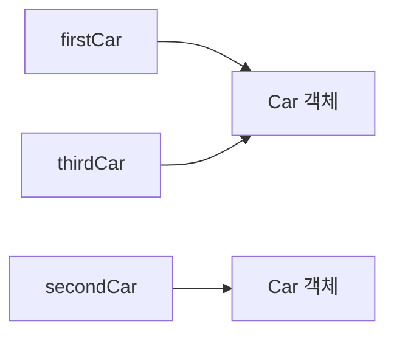

# Solution02로 이해하는 객체와 인스턴스

이 문서는 [`Solution02.java`](./Solution02.java)에 나온 내용만 짧게 정리한다.

## 핵심

| 개념 | 설명 |
|---|---|
| 클래스 | `Car` 같은 설계도 |
| 객체/인스턴스 | `new Car()`로 만든 실제 값 |
| 참조 비교 | `==`는 같은 객체를 가리키는지 본다 |

- `firstCar`와 `secondCar`는 서로 다른 객체다.
- `thirdCar = firstCar`는 객체 복사가 아니라 참조 복사다.

## 면접용 한 줄

| 질문 | 답 |
|---|---|
| 객체와 참조의 차이는? | 객체는 실제 인스턴스, 참조는 그 객체를 가리키는 변수다. |
| `==`는 무엇을 비교하나? | 참조값이 같은지 비교한다. |

