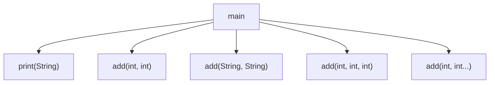

# Solution03로 이해하는 메서드와 오버로딩

이 문서는 [`Solution03.java`](./Solution03.java)에 나온 내용만 짧게 정리한다.

## 핵심

| 개념 | 설명 |
|---|---|
| 메서드 | 입력을 받아 일을 하고 결과를 돌려주는 함수 |
| `return` | 값을 반환한다 |
| 오버로딩 | 같은 이름, 다른 매개변수 목록 |
| 가변인자 | `int... numbers`처럼 개수를 유연하게 받는다 |

- 자바는 매개변수 타입/개수로만 오버로딩을 구분한다.
- `add(int, int...)`는 여러 개의 숫자를 받을 수 있다.

## 면접용 한 줄

| 질문 | 답 |
|---|---|
| 오버로딩 기준은? | 메서드 이름이 같고 매개변수 목록이 달라야 한다. |
| 가변인자 주의점은? | 항상 마지막 매개변수여야 한다. |

