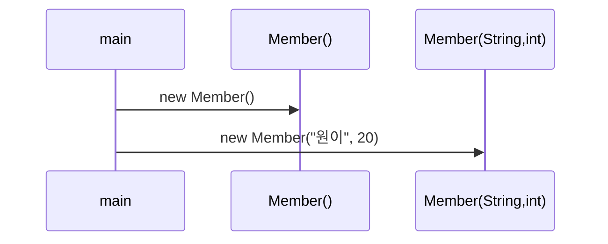

# Solution04로 이해하는 생성자

이 문서는 [`Solution04.java`](./Solution04.java)에 나온 내용만 짧게 정리한다.

## 핵심

| 개념 | 설명 |
|---|---|
| 생성자 | 객체를 만들 때 초기값을 넣는 메서드 |
| 기본 생성자 | 생성자가 없으면 컴파일러가 만들어준다 |
| 생성자 오버로딩 | 매개변수가 다른 생성자를 여러 개 둘 수 있다 |

- `Member()`는 기본값 상태로 만든다.
- `Member(String name, int age)`는 전달한 값으로 필드를 덮어쓴다.

## 면접용 한 줄

| 질문 | 답 |
|---|---|
| 생성자의 역할은? | 객체 초기화다. |
| 기본 생성자는 언제 생기나? | 명시적 생성자가 없을 때 컴파일러가 만든다. |

