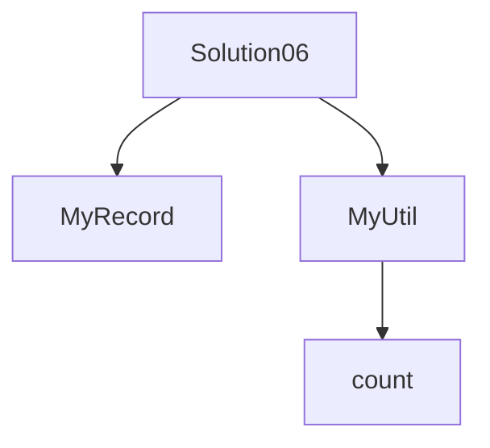

# Solution06로 이해하는 중첩 타입

이 문서는 [`Solution06.java`](./Solution06.java)에 나온 내용만 짧게 정리한다.

## 핵심

| 개념 | 설명 |
|---|---|
| nested class | 클래스 안에 선언된 클래스 |
| nested record | 관련 데이터 묶음을 간단히 표현 |
| 접근 | 바깥 클래스 이름으로 호출한다 |

- `Solution06.MyUtil.incrementCount()`처럼 호출한다.
- `MyRecord`는 이름과 나이만 담는 단순 데이터 표현이다.

## 면접용 한 줄

| 질문 | 답 |
|---|---|
| nested 타입을 쓰는 이유는? | 특정 클래스와 강하게 묶인 타입을 표현하기 좋다. |
| `record`는 무엇에 적합한가? | 변경이 적은 데이터 전달용 객체에 적합하다. |

