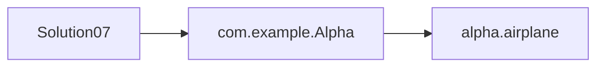

# Solution07로 이해하는 패키지와 접근 제어

이 문서는 [`Solution07.java`](./Solution07.java)에 나온 내용만 짧게 정리한다.

## 핵심

| 개념 | 설명 |
|---|---|
| 패키지 | 클래스의 소속/경로 |
| `public` | 다른 패키지에서도 접근 가능 |
| default | 같은 패키지에서만 접근 가능 |
| `private` | 같은 클래스 안에서만 접근 가능 |

- `Solution07`은 `com.example.Alpha`를 import 해서 사용한다.
- 이 workspace에는 `com.example` 소스가 없어서 내부 구현은 여기서 설명하지 않는다.
- 주석에 나온 것처럼 클래스/멤버별 접근 가능 범위가 다르다.

## 면접용 한 줄

| 질문 | 답 |
|---|---|
| 패키지가 왜 필요한가? | 클래스 묶음과 접근 범위를 나누기 위해서다. |
| `private` 필드는 왜 쓰나? | 외부에서 직접 바꾸지 못하게 막기 위해서다. |

