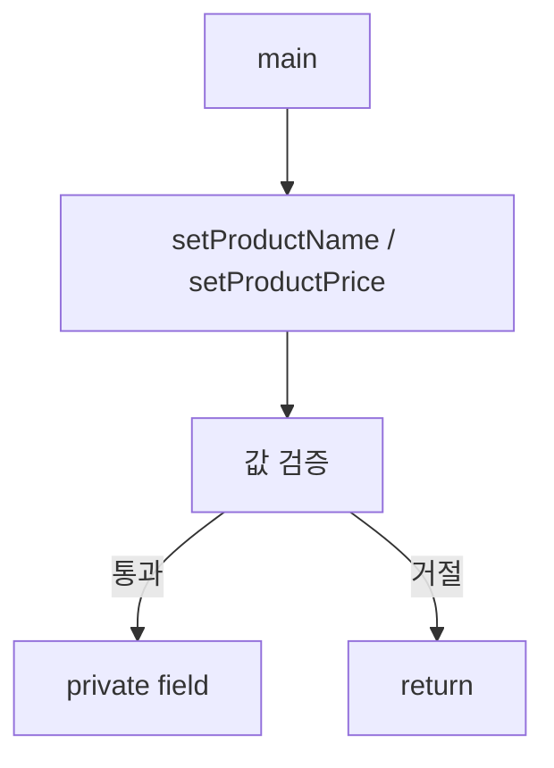

# Solution08로 이해하는 캡슐화와 검증

이 문서는 [`Solution08.java`](./Solution08.java)에 나온 내용만 짧게 정리한다.

## 핵심

| 개념 | 설명 |
|---|---|
| 캡슐화 | 필드를 숨기고 메서드로 다루는 방식 |
| getter | 값을 꺼내는 메서드 |
| setter | 값을 넣는 메서드 |
| 검증 | 잘못된 값이면 막는다 |

- `Manager`는 필드가 공개되어 직접 수정 가능하다.
- `Manager2`는 필드를 `private`로 두고 메서드로만 다룬다.
- `getArr()`는 `Arrays.copyOf`로 사본을 돌려준다.

## 면접용 한 줄

| 질문 | 답 |
|---|---|
| 캡슐화가 왜 중요한가? | 필드 변경을 통제하고 검증하기 좋다. |
| 배열 getter에서 사본을 주는 이유는? | 외부에서 원본이 직접 바뀌는 걸 막기 위해서다. |

